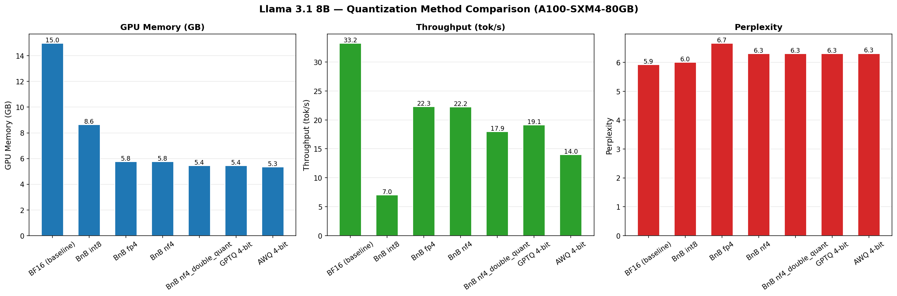

# Quantization Benchmark: Llama 3.1 8B on A100

We benchmarked 7 quantization configurations of Llama 3.1 8B on a single A100-SXM4-80GB, measuing GPU memory, generation throughput, and perplexity (WikiText-2).

## Results

| Method | Memory (GB) | Throughput (tok/s) | Perplexity | Disk Size (GB) |
|---|---:|---:|---:|---:|
| **BF16 (baseline)** | 14.96 | 33.21 | 5.92 | 14.96 |
| BnB INT8 | 8.63 | 7.03 | 6.00 | 14.96 |
| BnB FP4 | 5.76 | 22.30 | 6.66 | 14.96 |
| BnB NF4 | 5.76 | 22.22 | 6.31 | 14.96 |
| BnB NF4 + double quant | 5.43 | 17.94 | 6.31 | 14.96 |
| GPTQ 4-bit | 5.44 | 19.14 | 6.31 | 5.34 |
| AWQ 4-bit | 5.33 | 13.97 | 6.31 | 5.33 |

BnB methods show 14.96 GB on disk because they quantize on-the-fly from the original BF16 checkpoint. GPTQ and AWQ ship pre-quantized weights that are ~3x smaller.



## Analysis

### Memory

All 4-bit methods land between 5.3-5.8 GB — roughly a **2.7x reduction** from the 15 GB baseline. The differences betwen them are small. BnB INT8 sits in the middle at 8.6 GB (~1.7x reduction), which is a lot of VRAM to spend for a marginal quality gain.

### Throughput

This is where the methods really diverge. BnB FP4/NF4 are the fastest quantized options at ~22 tok/s (67% of BF16), because their dequantization is simple enough to stay memory-bandwith-bound. GPTQ lands at 19.1 tok/s — the `desc_act=True` config hurts parallelism, and we're not using Marlin kernels here. AWQ comes in at 14.0 tok/s due to AutoAWQ's unoptimized GEMM kernels (the library is now deprecated in favor of vLLM's `llm-compressor`). BnB INT8 is by far the slowest at 7.0 tok/s — the runtime outlier decomposition into separate FP16 and INT8 paths adds a lot of overhead.

**Important caveat:** In production with vLLM or TGI, GPTQ and AWQ would be much faster thanks to Marlin kernels, which fuse dequantization into the matmul and aproach BF16 speeds. These benchmarks use HuggingFace `generate()`, so they reflect the library-native kernel performance, not what you'd see in a serving framework.

### Quality

NF4, GPTQ, and AWQ all converge to the same perplexity (~6.31), despite using very diferent quantization strategies. BnB INT8 is nearly lossless at 6.00. The one to avoid is BnB FP4 at 6.66 — uniform 4-bit quantization wastes precision in the distribution tails, which is exactly why NF4 was invented.

### When to choose each

| Scenario | Method | Why |
|---|---|---|
| GPU serving (vLLM/TGI) | GPTQ or AWQ + Marlin | 3x smaller checkpoint, fastest kernels at scale |
| Quick experimentation | BnB NF4 | One flag, no calibration, good quality |
| Fine-tuning (QLoRA) | BnB NF4 + double quant | Designed for this; smallest frozen backbone |
| Near-zero quality loss | BnB INT8 | Preserves outlier features; accept the speed hit |
| Local / CPU / Apple Silicon | GGUF via llama.cpp | Not benchmarked here; see [quantization_methods.md](quantization_methods.md)  |

**Bottom line:** For production GPU serving, use GPTQ or AWQ with Marlin kernels — you get 3x smaller checkpoints, near-BF16 throughput, and the same quality as NF4. For experimentation and fine-tuning, BnB NF4 is hard to beat for convenience. Skip FP4 and INT8 unless you have a specific reason.

## Reproducing

See [RUN_IN_POD.md](RUN_IN_POD.md) for RunPod setup. All benchmarks ran on an A100-SXM4-80GB with PyTorch 2.4-2.10 and CUDA 12.4-12.8.

```bash
uv run benchmark_baseline.py
uv run benchmark_bnb.py
uv run benchmark_gptq.py
uv run benchmark_awq.py
uv run compare_results.py    # generates table + chart
```

Results are saved to `results/`. For a deep dive into how each algorithm works, see [quantization_methods.md](quantization_methods.md).
