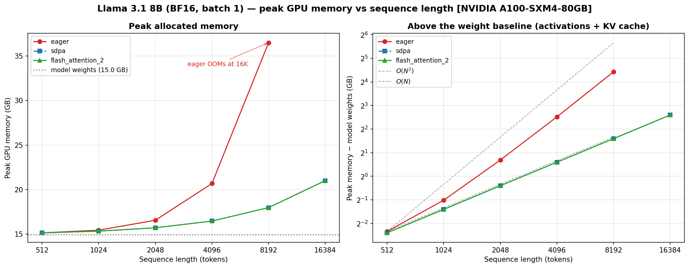
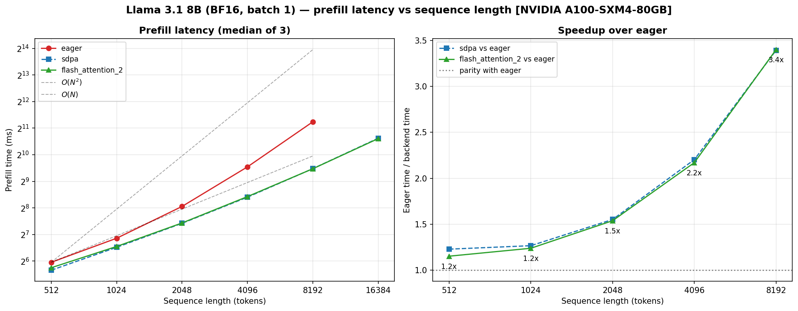

# Attention Backends: eager vs SDPA vs FlashAttention-2

How much does the attention implementation actually matter? This compares the
three `attn_implementation` options in `transformers` on Llama 3.1 8B (BF16,
batch 1, one A100-SXM4-80GB).

- Benchmark: [`benchmarks/benchmark_attention.py`](./benchmarks/benchmark_attention.py)
- Raw data: [`benchmarks/results_attention.json`](./benchmarks/results_attention.json)
- Plots: [`benchmarks/plot_attention.py`](./benchmarks/plot_attention.py)

## The numbers

| seq len | eager | sdpa | FA2 | peak mem eager | peak mem sdpa/FA2 |
| ------: | ----: | ---: | --: | -------------: | ----------------: |
|     512 |   62 ms |   50 ms |   54 ms | 15.15 GB | 15.15 GB |
|    1024 |  116 ms |   92 ms |   94 ms | 15.45 GB | 15.34 GB |
|    2048 |  266 ms |  171 ms |  173 ms | 16.57 GB | 15.72 GB |
|    4096 |  746 ms |  339 ms |  344 ms | 20.69 GB | 16.48 GB |
|    8192 | 2416 ms |  712 ms |  711 ms | 36.47 GB | 17.99 GB |
|   16384 | **OOM** | 1575 ms | 1560 ms | **OOM**  | 21.00 GB |

Three things worth knowing:

1. **Eager memory grows quadratically. Flash memory grows linearly.** Double
   the context and eager needs 4× more scratch space; the Flash kernels need
   2×. At 16K eager wants ~85 GB and dies on an 80 GB card.
2. **The speedup is about moving bytes, not doing math.** 3.4× faster prefill
   at 8K, and growing. Attention is only ~21% of the arithmetic at 8K but
   ~78% of eager's wall clock.
3. **sdpa and FA2 are the same kernel.** They match everywhere within noise,
   because PyTorch's SDPA dispatches to its own bundled FlashAttention on
   Ampere and BF16. On a recent PyTorch you already have FlashAttention —
   installing `flash-attn` buys you nothing here.

**How it was measured.** One warmup then 3 timed runs per cell, median
reported. Prefill is a single forward with `use_cache=True`. Decode is
`generate(max_new_tokens=64)`. Memory is `max_memory_allocated`, with the
counters reset right before each measurement. OOMs are caught per cell so one
failure doesn't kill the sweep. Batch 1 is deliberate — it keeps the N² term
front and center instead of amortizing it across a batch.

## Memory: where the gigabytes go



The left panel looks boring, and that is the lesson. At batch 1 the model
weights are 15 GB, and until about 8K everything else is a rounding error next
to them. The right panel subtracts those 15 GB, and the two growth rates
separate immediately.

The interesting part is that you can predict the measured bytes on paper.

**What sdpa and FA2 spend above the weights** is just the KV cache and the
output logits. Both grow linearly with sequence length:

```
KV cache = 2 · 32 layers · 8 kv-heads · 128 dim · 2 bytes  = 128 KB per token
logits   = 128256 vocab · 2 bytes                          = 250 KB per token
```

| N | predicted | measured |
| ---: | ---: | ---: |
| 2048 | 0.74 GB | 0.76 GB |
| 4096 | 1.48 GB | 1.52 GB |
| 8192 | 2.96 GB | 3.03 GB |
| 16384 | 5.91 GB | 6.04 GB |

Two details worth noticing. Llama 3.1 uses grouped-query attention — 8 KV
heads instead of 32 — so the KV cache is already 4× smaller than it would
otherwise be. And at 8K the logits tensor is actually *bigger* than the KV
cache, which surprises people.

**What eager spends on top of that** is the attention score matrix, and HF's
eager path holds it roughly four times over: the BF16 result of `QKᵀ`, the FP32
softmax intermediate (twice the bytes), and the BF16 cast back.

```
eager overhead ≈ 4 · 32 heads · N² · 2 bytes
```

| N | predicted | measured |
| ---: | ---: | ---: |
| 2048 | 1.00 GB | 0.85 GB |
| 4096 | 4.00 GB | 4.21 GB |
| 8192 | 16.00 GB | 18.48 GB |

Extend that one step and you get the OOM:

```
16K eager = 15.0 weights + 5.9 KV/logits + 64.0 scores = 84.9 GB  >  79.2 GB card
```

That 64 GB is the entire argument for FlashAttention in a single number. Flash
never allocates it. The N×N block is built inside the GPU's small on-chip
memory, used, and thrown away — so FA2's 16K peak is 21 GB, and the same card
has room for roughly 4× more context.

## Speed: why avoiding those bytes makes it faster



Both axes are log, so a power law becomes a straight line and the slope is the
exponent. Eager starts near slope 1 — at short context the feed-forward layers
dominate and attention barely registers — then bends toward slope 2 as N²
takes over. The Flash curves stay near slope 1 the whole way.

Speedup over eager: 1.2× at 512, 1.5× at 2048, 2.2× at 4096, 3.4× at 8192, and
infinite at 16K where eager can't run. It's small at short context simply
because attention is a small part of the work there.

### The counterintuitive part

FlashAttention does not do less arithmetic. It does *more* — the paper measures
75.2 vs 66.6 GFLOPs on GPT-2 medium — and still runs about 6× faster. So the
speedup has to come from somewhere else.

That somewhere is memory traffic. A GPU has two kinds of memory: **HBM**, the
big slow pool (80 GB on an A100), and **SRAM**, a tiny fast scratchpad on each
compute unit (~192 KB). An A100 does 312 TFLOP/s of BF16 math but only reads
2.04 TB/s from HBM — roughly 150 arithmetic operations per byte fetched. If
your kernel does less math per byte than that, the math units sit idle waiting
for memory.

Softmax is exactly that kind of kernel. It reads an N×N matrix and writes an
N×N matrix while doing almost nothing per element. So standard attention is
**memory-bound**: its runtime is set by how many bytes cross HBM, not by how
many FLOPs it performs. Optimize the FLOPs and nothing happens. Optimize the
bytes and everything does.

### What FlashAttention changes

| | HBM accesses | Extra memory |
| --- | --- | --- |
| Standard attention | Θ(Nd + N²) | O(N²) |
| FlashAttention | **Θ(N²d²/M)** | **O(N)** |

N is sequence length, d is head dimension, M is SRAM size. Since d² is much
smaller than M in practice (d is 64–128, M is ~192 KB), `N²d²/M` is far below
`N²`. Dao et al. also prove no *exact* attention algorithm can do
asymptotically better, so this is optimal up to constants.

The trick that makes it possible is **online softmax**. You can't tile
attention naively, because softmax normalizes across an entire row and so
couples every block to every other block. The fix is to carry two running
numbers per row — the running max and the running sum of exponentials — and
correct the result as each new block arrives. That makes softmax streamable,
which makes tiling legal, which means the N×N block never has to leave SRAM.
The output is the same as standard attention up to floating-point ordering.
This is an exact algorithm, not an approximation.

Full derivation in
[`knowledge-base/attention/flash-attention/core-idea.md`](../../knowledge-base/attention/flash-attention/core-idea.md).

### Checking it against this run

At 8K, per layer, HF's eager path pushes the score matrix through HBM about
six times: write it from `QKᵀ`, read and write it for the causal mask, read it
and write the FP32 softmax, read that back and write the BF16 cast, then read
it again for `PV`. That's ~40 GB per layer, **~1.37 TB across 32 layers**. A
Flash kernel's floor is Q, K, V and O crossing HBM once each: ~6 GB total.
**Roughly 200× less traffic.**

Now put that against the clock:

```
attention FLOPs @ 8K = 35.2 TFLOP   (21% of prefill)
linear FLOPs   @ 8K  = 131.6 TFLOP  (79%)

FA2 attention at ~60% of peak      ≈ 188 ms
  → so the shared linear layers    ≈ 523 ms   (711 ms total − 188 ms)
eager attention = 2416 ms − 523 ms ≈ 1893 ms
  → 35.2 TFLOP / 1.893 s = 19 TFLOP/s = 6% of peak
```

Eager runs the attention math at **6% of what the GPU can do**. FA2 runs it at
about 60%. A 10× efficiency gap on 21% of the work is what produces the 3.4×
end-to-end speedup.

Two honest limits on this analysis. First, the traffic model predicts ~963 ms
against ~1893 ms measured — right order of magnitude, but the extra passes,
kernel launches and mask construction that a first-order byte count ignores
account for the rest. Second, the theoretical traffic reduction is a factor of
`M/d²`, which at d=128 is only about 3× — yet the measured attention speedup is
closer to 10×. The reason is that HF's eager path is considerably worse than
the paper's idealized baseline; the FP32 softmax upcast alone doubles the bytes
and adds two full round trips. Real baselines lose more than the theory says.
That's a reason to measure, not a reason to doubt the framework.

## Decode barely benefits

| seq len | eager | sdpa | FA2 |
| ------: | ----: | ---: | --: |
|     512 |  35.5 | 42.5 | 33.9 |
|    2048 |  31.9 | 14.4* | 31.9 |
|    4096 |  25.9 | 35.8 | 29.5 |
|    8192 |  14.9 | 29.9 | 25.3 |
|   16384 | **OOM** | 21.7 | 18.9 |

<sub>tokens/sec. *One noisy measurement, not a real regression — its neighbours
are 41.5 and 35.8.</sub>

Decode has no N² term at all. Each step attends one new query against N cached
keys, so the score "matrix" is a single row — linear in N and tiny.
FlashAttention's whole job is avoiding a large N×N intermediate, and at decode
time there isn't one.

What decode is limited by instead is reading weights and KV cache. At 8K
context every step must pull 16.1 GB off HBM:

```
16.1 GB / 2.04 TB/s = 7.9 ms per step → ~119 tok/s ceiling
```

Measured sdpa is 29.9 tok/s, about 25% of that. The gap is per-step Python
overhead in `generate` — no CUDA graphs, no batching.

**The takeaway: prefill and decode are different problems.** FlashAttention is
a prefill optimization. Decode wants PagedAttention, continuous batching,
speculative decoding and quantized weights instead.

(Eager still decays faster than sdpa with context — 35.5 → 14.9 vs 42.5 → 29.9
— because its unfused softmax moves about twice the bytes per step. It OOMs at
16K for the boring reason that `generate` runs a prefill first.)

## Caveats

- One GPU, 3 runs per cell. The small numbers are within a few percent of each
  other and shouldn't be read as a ranking.
- Random token ids — fine for latency and memory, meaningless for quality.
- Peak memory is the allocator's high-water mark, so it includes fragmentation
  and slightly overstates live bytes.
- The time split assumes the linear layers cost the same in both backends and
  that FA2 hits ~60% of peak. Both are reasonable; neither is measured here. A
  kernel profile would settle it.
- d=128 is on the large side. Models with d=64 get a bigger theoretical win.

## Reproducing

```bash
# On a CUDA box (pod setup: ../RUN_IN_POD.md)
cd inference/03_attention/benchmarks
uv run python benchmark_attention.py   # → results_attention.json
uv run python plot_attention.py        # → plots/attention_*.png
```

The plot script only reads the JSON, so you can regenerate the figures without
a GPU.

## Also here: attention visualizer

[`visualize_attention.py`](./visualize_attention.py) renders attention weights
as a bipartite graph — queries on the left, keys on the right, line opacity
proportional to weight. Pick a layer, toggle heads, hover a token to isolate
its edges.

```bash
python visualize_attention.py --model gpt2 \
    --text "The animal didn't cross the street because it was too tired."
```

Any HF causal LM that supports `attn_implementation="eager"` works. Use small
models — the weights are `(layers, heads, seq, seq)` floats held in RAM.

There's a direct connection to everything above: `output_attentions=True`
*requires* the eager path. SDPA and FlashAttention return `None`, because the
N×N matrix you'd want back is exactly the thing they were built never to
create. Interpretability tooling pays the quadratic cost by design.

## References

- Dao et al. *FlashAttention: Fast and Memory-Efficient Exact Attention with
  IO-Awareness.* [arXiv:2205.14135](https://arxiv.org/abs/2205.14135)
- Dao. *FlashAttention-2.* [arXiv:2307.08691](https://arxiv.org/abs/2307.08691)
- Milakov & Gimelshein. *Online normalizer calculation for softmax.*
  [arXiv:1805.02867](https://arxiv.org/abs/1805.02867)
- Local notes: [`knowledge-base/attention/`](../../knowledge-base/attention/)
